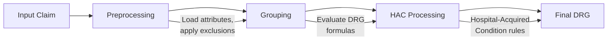

# MS-DRG Grouper Overview

The MS-DRG (Medicare Severity Diagnosis Related Groups) grouper classifies patient claims into diagnosis-related groups based on diagnoses, procedures, demographics, and other clinical factors.

## How it works

The grouper follows the CMS DRG classification logic:



1. **Preprocessing** — loads diagnosis attributes, applies exclusions, clusters codes
2. **Grouping** — evaluates DRG formulas against the claim's clinical profile
3. **HAC Processing** — applies Hospital-Acquired Condition rules based on `hospital_status`
4. **Final Grouping** — produces the final DRG assignment

The entire pipeline mirrors the CMS Java grouper and is validated claim-by-claim against it.

## Basic usage

```python
import msdrg

with msdrg.MsdrgGrouper() as g:
    result = g.group({
        "version": 431,
        "age": 65,
        "sex": 0,
        "discharge_status": 1,
        "pdx": {"code": "I5020"},
    })
```

## Helper function

The `create_claim()` convenience function builds the nested dict structure for you:

```python
claim = msdrg.create_claim(
    version=431, age=65, sex=0, discharge_status=1,
    pdx="I5020", sdx=["E1165"], procedures=["02703DZ"]
)
```

See the full function signature in the [API Reference](../api-reference.md#create_claim).

## Thread safety

The grouper context is immutable after initialization and safe to share across threads. Each call to `group()` is thread-safe.

!!! note
    Create one `MsdrgGrouper` instance and reuse it. The initialization loads binary data via memory mapping — subsequent calls to `group()` are fast.
