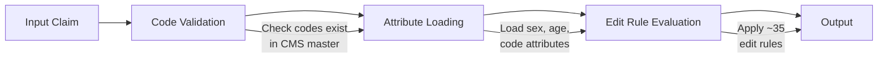

# MCE Overview

The Medicare Code Editor (MCE) validates ICD diagnosis and procedure codes against CMS edit rules. It checks for invalid codes, sex conflicts, age conflicts, unacceptable PDX codes, and more.

## How it works

The MCE is a linear validation pipeline:



1. **Code validation** — checks codes exist in the CMS master for the discharge date
2. **Attribute loading** — loads code attributes (sex restrictions, age groups, etc.)
3. **Edit rule evaluation** — applies ~35 edit rules
4. **Output** — returns edit type and per-edit counts

## Basic usage

```python
import msdrg

with msdrg.MceEditor() as mce:
    result = mce.edit({
        "discharge_date": 20250101,
        "age": 65,
        "sex": 0,
        "discharge_status": 1,
        "pdx": {"code": "I5020"},
        "sdx": [],
        "procedures": []
    })

print(result["edit_type"])  # "NONE" or "PREPAYMENT", etc.
```

Or use the convenience helper:

```python
mce_claim = msdrg.create_mce_input(
    discharge_date=20250101, age=65, sex=0, discharge_status=1,
    pdx="I5020", sdx=["E1165"]
)
result = mce.edit(mce_claim)
```

## Validation

The MCE is validated against the CMS Java MCE 2.0 v43.1 with a **100% match rate** on 49,996 test claims.

## Thread safety

The MCE context is immutable after initialization and safe to share across threads. Each call to `edit()` is thread-safe.

!!! note
    Create one `MceEditor` instance and reuse it. Initialization loads binary data via memory mapping — subsequent calls are fast.
